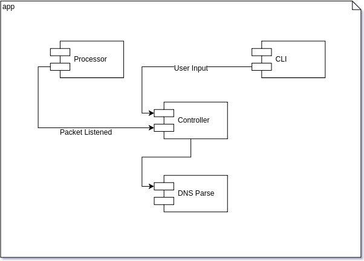

# CS6250-SDNBlocking

## Design

### Overview

### Component Details

#### 1. CLI

CLI handles the user input event in ONOS framework. It accepts different user inputs and show the coresponding 
data or results.

*details see [here](https://wiki.onosproject.org/display/ONOS/CLI+and+Service+Tutorial#CLIandServiceTutorial-1.Createacommandclass.)*

Our accepted command lines (app stands for our application name):

        app add-block [host-name] # add host into block list
        app del-block [host-name] # remove host from block list
        app block show # show block list
        
#### 2. Controller

Controller was called by Processor and CLI to maintain the block list and delegate the packet processing.

It must maintain a [ConcurrentHashMap](https://web.archive.org/web/20140604083201/http://www.codercorp.com/blog/java/why-concurrenthashmap-is-better-than-hashtable-and-just-as-good-hashmap.html) in memory as blocking list

Controller needs following functions to be called by CLI & Processor

        boolean parsePakcet(UDP udpPacket);
        
        void addBlockHost(String host);
        
        void removeBlockHost(String host);
        
        Set<Map.Entry> showBlockList();
        
#### 3. Processor

Processor implements ONOS's processor interface, in ONEPINGPING demo app has the details

#### 4. DNS Parser

DNS parser's responsibility is to parse the UDP payload to check whether this packet is a DNS request.
 If it is, parse the packet and get the information.
 
 Jetty has an implementation of [DNS parser](https://github.com/mbakkar/netty-1/blob/master/codec-dns/src/main/java/io/netty/handler/codec/dns/DnsResponseDecoder.java)
 
 